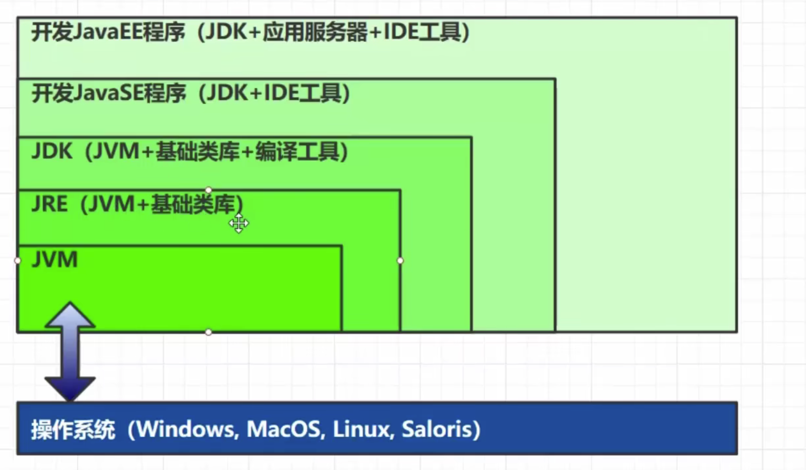
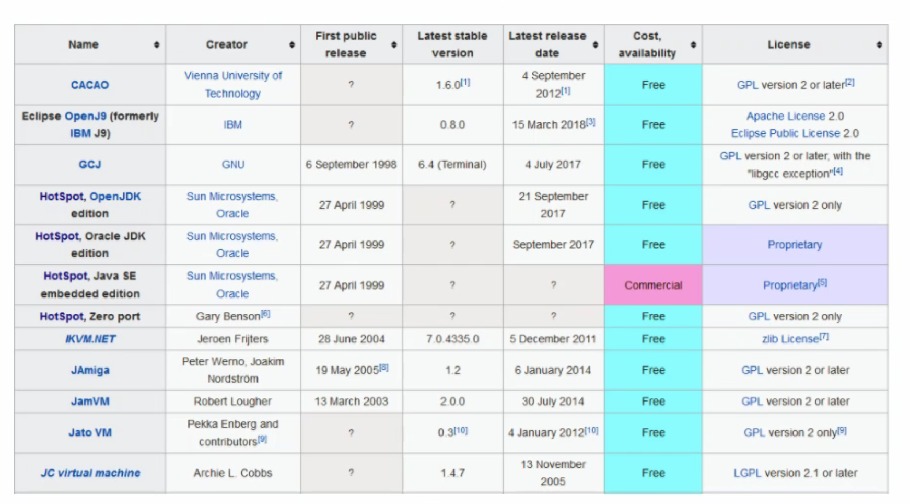
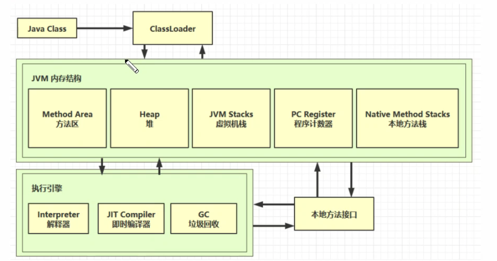

## 什么是JVM?

定义: Java Virtual Machine - java程序的运行环境 (java 二进制字节码的运行环境)

好处:
* 一次编写,到处运行: javac -> class字节码 -> 在jvm上运行
* 自动内存管理,垃圾回收
* 数组下标越界的检查
* 多态

比较: JVM, JRE, JDK

> 基础类库: lang
> 编译工具: javac

---
## 学习JVM可以面试

* 面试
* 理解底层实现原理

`JVM是一套规范,有多种实现`
常用的jvm是hotspot

## 学习路线

**ClassLoader**: 加载编译好的字节码的文件到内存
**JIT Compiler**: 对热点代码进行优化
**本地方法接口**: 调用系统的接口

1. JAVA内存结构
2. GC垃圾回收
3. JAVA class
4. ClassLoader
5. JIT Compiler 即时编译器

