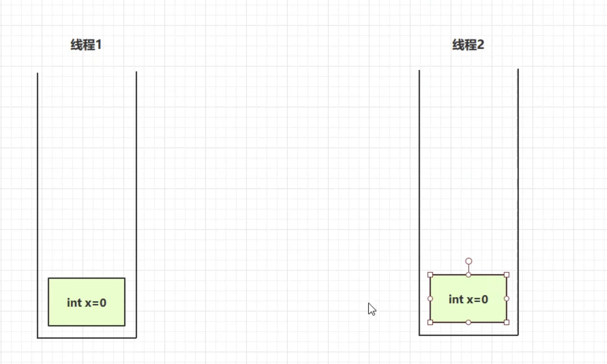

# 内存结构

1. 程序计数器
2. 虚拟机栈
3. 本地方法栈
4. 堆
5. 方法区

## 程序计数器
### 定义
Program Counter Register 程序计数器(寄存器)

特点: 
1. 保存下一条指令执行的地址
2. 线程私有的
   1. 在进行线程切换的时候, 程序计数器需要保存当前线程需要执行下一条执行的地址
3. 是*唯一*不会出现内存溢出的
   
   

### 作用


* 右边是java源代码
* 运行的时候,要编译成左边的**二进制字节码**
* CPU里的解释器, 将二进制字节码转换成机器码,让CPU运行
* 程序计数器主要就是记住下一条JVM指令执行的地址
* 字节码前面的数字就是一个地址
* **解释器**根据**程序计数器**去取指令,同时在解析的时候,程序计数器里存下一条指令
* 由于读取指令的操作很频繁, 所以程序计数器使用寄存器实现, 速度很快

> 这里取然后转换为机器码是实时进行转换吗? 这样速度不会很慢吗?

---
## 虚拟机栈

栈帧: 每个方法运行时需要的内存
* 参数
* 局部变量
* 返回地址

### 定义

JAVA Virtual Machine Stacks (JAVA虚拟机栈)
* 每个线程运行时需要的内存,称为虚拟机栈
* 每个栈由多个栈帧(FRAME)组成, 对应着当前每次方法调用时所占用的内存
* 每个线程只有有一个活动的栈帧, 对应着当前正在执行的那个方法

问题辨析
1. 垃圾回收是否涉及栈内存? 垃圾回收是针对堆内存的
2. 栈内存分配越大越好吗? 
   1. 可以通过虚拟机参数进行指定 `-Xss`, 如果不指定,默认情况下是
   2. 栈内存变大, 会导致**线程数变少**
3. 方法内的局部变量是否线程安全?
   1. 是否线程安全, 看下这个变量是共用的还是私有的
   2. 这个x是方法内的局部变量, 所以不会有线程安全的问题 
   3. 如果改成static后就是**线程不安全**的, 因为每个线程要将变量读到自己的工作内存后, 然后再进行相关操作后, 再重新写回那块共享的内存空间, 所以这个时候会出现线程不安全的问题 
   4. 第一个线程安全, 第二个线程不安全, 第三个线程不安全: 变量是否逃离方法的作用范围 


### 栈内存溢出

* 栈帧过多导致栈内存溢出, 递归太深
* 栈帧过大

具体案例: 
1. 栈帧过多 
2. 可以通过VM options 进行栈帧大小的设置
3. 第三方的库也可能导致*StackOverFlow*, 两个类的循环引用, JSON在转换的时候也会出现溢出

### 程序运行诊断

* 案例1: CPU占用过多
  * top 命令可以查看进程 
  * ps H -eo pid, tid, %cpu 查看进程,线程,cpu
  * grep 进程id, 定位刚刚发现的占用高的进程的线程
  * jstack 进程id 
  * jstack 里的进程编号是16进制的, ps获得的是10进制的
  * 查看到问题线程, 发现一直是**Runnable**状态, 并且可以看到问题代码 

* 案例2: 程序运行很长时间没有结果
  * 排查线程死锁的问题
  * jstack 进程id
  * 查看输出 
  * 定位到了死锁, 然后定位源代码 

---
## 本地方法栈

本地方法是由来C or C++编写的
object中的clone方法 
**本地方法栈**给本地方法的运行提供内存空间

---
## 堆

* 通过new关键字, 创建对象都会使用堆内存
特点
* 它是线程共享的, 堆中对象都需要考虑线程安全的问题
* 垃圾回收机制管理的区域

### 堆内存溢出

为了更快能看到溢出, 可以修改虚拟机参数`-Xmx`


### 堆内存诊断

1. jps工具
   1. 查看当前系统中有哪些java进程
2. jmap工具
   1. 查看堆内存占用情况,只能查看某一个时刻
3. jconsole工具
   1. 图形界面, 多功能监测工具, 可以连续监测

**演示程序**


1. 首先通过jps查看 
2. 在不同时间点抓取内存快照信息 
3. 看到堆的配置信息 
4. 堆内存的占用 

jconsole 的使用, 直接在terminal输入jconsole

或者使用jvisualVM
* 将某一时刻堆内存dump下来
  

## 方法区

JVM规范中对方法区的定义: 


方法区再虚拟机**启动**时被创建, 方法区是逻辑上是堆的一部分, `每个jvm的实现不同`

永久代 -> 元空间


### 方法区内存溢出


* 类加载器可以用来加载类的字节码
* ClassWriter 作用用来生成类的二进制字节码
* 记载class, 导致内存溢出
* 加载类: Spring, Mybatis
  


### 运行时常亮池
```
javap -v XXX.class
```
字节码文件的反编译


StringTable 是哈希表


