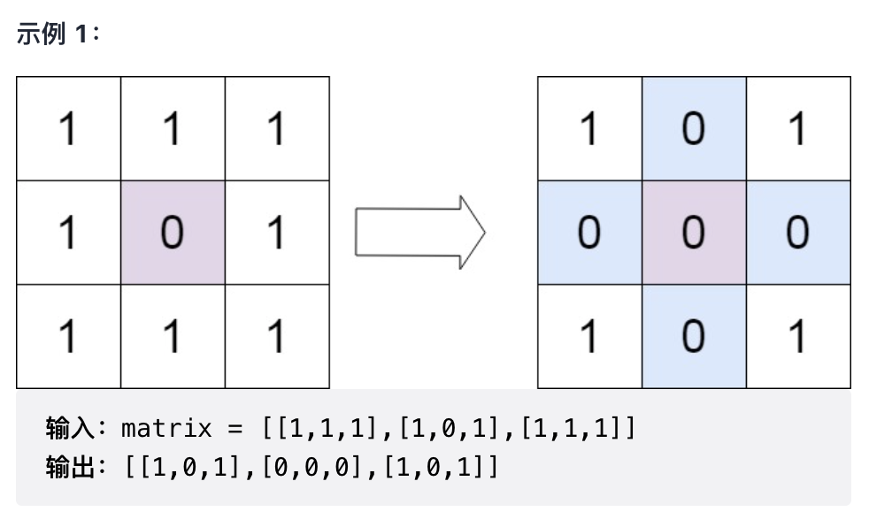

# Top面试题
56. 合并区间
[题目链接](https://leetcode-cn.com/problems/merge-intervals/)
以数组 intervals 表示若干个区间的集合，其中单个区间为 intervals[i] = [starti, endi] 。请你合并所有重叠的区间，并返回一个不重叠的区间数组，该数组需恰好覆盖输入中的所有区间。

>输入：intervals = [[1,3],[2,6],[8,10],[15,18]]
>输出：[[1,6],[8,10],[15,18]]
>解释：区间 [1,3] 和 [2,6] 重叠, 将它们合并为 [1,6].

>输入：intervals = [[1,4],[4,5]]
>输出：[[1,5]]
>解释：区间 [1,4] 和 [4,5] 可被视为重叠区间。

```java
class Solution {
    public int[][] merge(int[][] intervals) {
        if(intervals.length == 0 || intervals.length == 1){
            return intervals;
        }
        // 排序
        Arrays.sort(intervals, (a,b)->a[0]- b[0]);

        List<int[]> list = new ArrayList<>();
        list.add(intervals[0]);

        for(int i = 1; i < intervals.length; i++){
            int[] tmp = list.get(list.size() - 1);
            if(intervals[i][0] > tmp[1]){
                list.add(intervals[i]);
            }else{
                tmp[1] = Math.max(tmp[1], intervals[i][1]);
            }
        }
        return list.toArray(new int[list.size()][]);
    }
}
```
这里使用到了贪心算法的思想: 局部最优策略能导致产生全局最优解。

---
73. 矩阵置零
[题目链接](https://leetcode-cn.com/problems/set-matrix-zeroes/)

给定一个 m x n 的矩阵，如果一个元素为 0 ，则将其所在行和列的所有元素都设为 0 。请使用 原地 算法。

进阶：

* 一个直观的解决方案是使用  O(mn) 的额外空间，但这并不是一个好的解决方案。
* 一个简单的改进方案是使用 O(m + n) 的额外空间，但这仍然不是最好的解决方案。
* 你能想出一个仅使用常量空间的解决方案吗？
 


```java
class Solution {
    public void setZeroes(int[][] matrix) {
        boolean col = false;
        boolean row = false;

        for(int i = 0; i < matrix.length; i++){
            if(matrix[i][0] == 0){
                col = true;
                break;
            }
        }

        for(int i = 0; i < matrix[0].length; i++){
            if(matrix[0][i] == 0){
                row = true;
                break;
            }
        }

        for(int i = 1; i < matrix.length; i++){
            for(int j = 1; j < matrix[0].length; j++){
                if(matrix[i][j] == 0){
                    matrix[i][0] = 0;
                    matrix[0][j] = 0;
                }
            }
        }

        for(int i = 1; i < matrix.length; i++){
            for(int j = 1; j < matrix[0].length; j++){
                if(matrix[i][0] == 0 || matrix[0][j] == 0){
                    matrix[i][j] = 0;
                }
            }
        }

        if(col){
            for(int i = 0; i < matrix.length; i++){
                matrix[i][0] = 0;
            }
        }

        if(row){
            for(int i = 0; i < matrix[0].length; i++){
                matrix[0][i] = 0;     
            }
        }
    }
}
```
思路: 这里主要一个问题就是如果边遍历边修改, 那么就是会把之后遍历到的元素当成最开始就是0的情况, 所以我们需要就是有一个东西进行标记, 这里使用到了第一行和第一列进行标记, 并且通过两个变量去记录第一行列