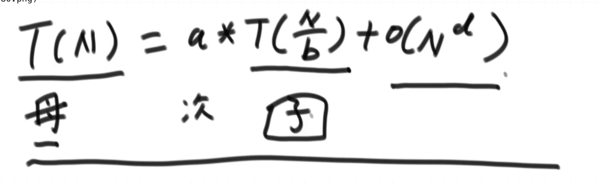
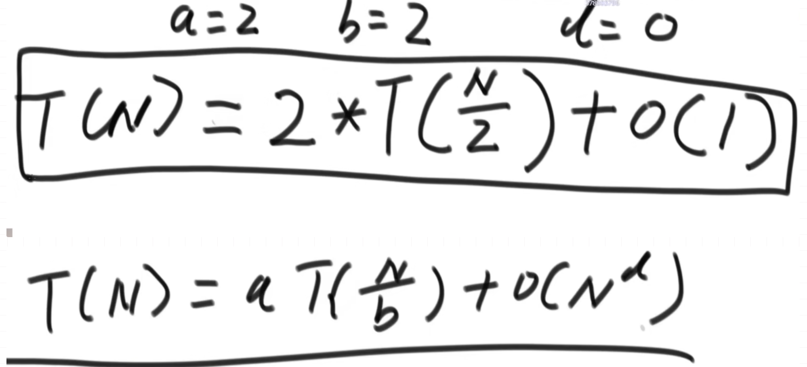
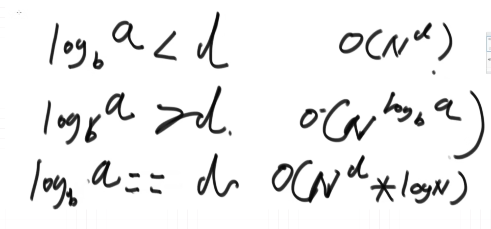

# 左神算法

## 了解时间复杂度

常数时间的操作

一个操作如果和样本数据量没有关系, 每次都是固定时间内的操作, 那么这个操作就是`常数操作`

```java
int a = arr[i] // 常数操作
int b = list.get(i) // 根据元素决定
```
数组根据index去取元素

求中点
```java
int mid = (l + r) / 2; // 可能会出现溢出
int mid = l + ((r - l) >> 1) // 用移位运算符更加快
```


**选择排序**

```java
public void selectSort(int[] arr){
        for(int i = 0; i < arr.length; i++){
            int min = arr[i];
            int index = i;
            for(int j = i; j < arr.length; j++){
                if(arr[j] <= min) {
                    min = arr[j];
                    index = j;
                }
            }
            if(index != i){
                swap(arr, index, i);
            }
        }
    }

    public void swap(int[] arr, int i, int j){
        int tmp = arr[i];
        arr[i] = arr[j];
        arr[j] = tmp;
    }
```

**时间复杂度**: 是一个等差数列, O(n^2),
**空降复杂度**: O(1)

**冒泡排序**
```java
    public void bubbleSort(int[] arr){
        for(int i = arr.length - 1; i > 0; i--){
            for(int j = 0; j < i; j++){
                if(arr[j] > arr[j+1]){
                    swap(arr, j, j+1);
                }
            }
        }
    }
```
**时间复杂度**: O(n^2)
**空间复杂度**: O(1)


**异或运算**: 是一种无进位相加

[136. 只出现一次的数字](https://leetcode-cn.com/problems/single-number/)
[260. 只出现一次的数字 III](https://mail.google.com/mail/u/0/#inbox)
第二题: 注意获取最后一个1的方法


**插入排序**

算法的时间复杂度都按照最差的来估计

```java
 public void insertSort(int[] arr){
        for(int i = 1; i < arr.length; i++){
            for(int j = i -1; j>=0 && arr[j] > arr[j+1]; j--){
                swap(arr, j, j+1);
            }
        }
    }
```
**时间复杂度**: O(n^2)
**空间复杂度**: O(1)


## 二分详解
1. 在一个有序数组中, 找某个数是否存在
2. 找这个数最左侧的位置
3. 局部最小值 [链接](https://leetcode-cn.com/problems/find-peak-element/)


---

## 分析递归行为的时间复杂度

2 / 2 -> 2 >> 1
master 公式
a*T(n/b)+O(n^x)
`等规模的才可以`

**master公式**





## 排序算法进阶

### 归并排序

```java
public void mergeSort(int[] arr, int l, int r){
        if(l == r){
            return;
        }
        int mid = l + ((r - l) >> 1);
        mergeSort(arr, l, mid);
        mergeSort(arr, mid+1, r);
        merge(arr, l, mid, r);
    }

    public void merge(int[] arr, int l, int mid, int r){
        int[] help = new int[r - l + 1];
        int i = 0;
        int p = l;
        int q = mid + 1;

        while(p <= mid && q <= r){
            help[i++] = arr[p] >= arr[q] ? arr[q++] : arr[p++];
        }

        while(p <= mid){
            help[i++] = arr[p++];
        }

        while(q <= r){
            help[i++] = arr[q++];
        }

        for (int i1 = 0; i1 < help.length; i1++) {
            arr[l+i1] = help[i1];
        }

    }
```


**时间复杂度**: O(N*logN)
**空间复杂度**: O(N)

**为什么归并排序快?**
到底因为什么时间复杂度降低了呢?
n2浪费了大量比较行为
每一轮的比较都是独立, 浪费比较
比较的关系都得到了保留

* 小和问题
leetocode上没有原题, 但是有一个改变的版本, 还需要使用索引数组. [315. 计算右侧小于当前元素的个数](https://leetcode-cn.com/problems/count-of-smaller-numbers-after-self/)

* 逆序对问题 [剑指 Offer 51. 数组中的逆序对](https://leetcode-cn.com/problems/shu-zu-zhong-de-ni-xu-dui-lcof/)


### 快速排序

**荷兰国旗**

给定一个数组arr, 和一个数num, 请把小于等于num的数放在数组的左边, 大于num的数放在数组的右边. 要求额外空间复杂度O(1), 时间复杂度O(N).


给定一个数组arr, 和一个数num, 请把小于等于num的数放在数组的左边, 大于num的数放在数组的右边, 等于num的数放在数组的中间. 要求额外空间复杂度O(1), 时间复杂度O(N). [75. 颜色分类](https://leetcode-cn.com/problems/sort-colors/)

* cur小于target, cur 与小于区域下一个交换, 小于区域往右扩 i++
* cur == target, i++
* cur > target, cur 与大于区域的前一个交换, 大于区域左边扩张, i不变

排序算法
```java
public void quickSort(int[] arr, int l, int r){
        if(l < r){
            swap(arr, l + (int)(Math.random() * (r - l + 1)), r);
            int[] p = partition(arr, l, r);
            quickSort(arr, l, p[0] - 1);
            quickSort(arr, p[1] + 1, r);
        }
    }

    public int[] partition(int[] arr, int l, int r){
        int less = l - 1;
        int more = r;

        while (l < more){
            if(arr[l] < arr[r]){
                swap(arr, ++less, l++);
            }else if(arr[l] > arr[r]){
                swap(arr, --more, l);
            }else if(arr[l] == arr[r]){
                l++;
            }
        }
        swap(arr, more, r);
        return new int[]{less+1, more};

    }
```


## 堆

左孩子: 2 * i + 1
右孩子: 2 * i + 2
父亲节点: i - 1 / 2

* 大根堆: 子树的最大值就是头节点
* 小根堆: 子树的最小值就是头节点

heapInsert: 向数组插入元素, 维护维护大根堆. 插入的元素都要跟上面的元素进行比较

返回最大值的过程, 首先让头节点和最后一个元素交换, 然后heapSize - 1, 然后头节点下沉, 往下和左右节点进行比较

优先级队列就是堆

```java
public void heapSort(int[] arr){
        if(arr.length == 0 || arr.length == 1){
            return;
        }

//        for (int i = 0; i < arr.length; i++) {
//            heapInsert(arr, i);
//        }

        for(int i = arr.length - 1; i >= 0; i--){
            heapify(arr, i, arr.length);
        }

        int heapSize = arr.length;
        swap(arr, 0, --heapSize);
        while(heapSize > 0){
            heapify(arr, 0, heapSize);
            swap(arr, 0, --heapSize);
        }
    }

    public void heapify(int[] arr, int i, int size){
        int left = 2 * i + 1;
        while(left < size) {
            int largest = left + 1 < size && arr[left] < arr[left + 1] ? left + 1 : left;

            largest = arr[largest] > arr[i] ? largest : i;

            if (largest == i) {
                break;
            }

            swap(arr, largest, i);
            i = largest;
            left = 2 * i + 1;
        }
    }

    public void heapInsert(int[] arr, int index){
        while(arr[index] > arr[(index - 1) / 2]){
            swap(arr, index, (index - 1) / 2 );
            index = (index - 1) / 2;
        }
    }
```

**题目**
已经有一个几乎有序的数组, 几乎有序是指, 如果数组排好顺序后, 每个元素移动的距离可以不超过k, 并且k相对于数组来说比较小. 请选择一个合适的排序算法针对这个数据进行排序.

```java
 public void sortArrayDistance(int[] arr, int k){
        PriorityQueue<Integer> queue = new PriorityQueue<>();
        int index = 0;
        for(; index < Math.min(arr.length, k); index ++){
            queue.add(arr[index]);
        }
        int i = 0;
        for(; index < arr.length; i++, index++){
            queue.add(arr[index]);
            arr[i] = queue.poll();
        }
        while(!queue.isEmpty()){
            arr[i++] = queue.poll();
        }
    }

```

### 🪣桶排序


## 哈希表

## 链表

## 树

## 图

**图的宽度优先遍历**:

1. 利用队列实现
2. 从源节点开始一次按照宽度进队列, 然后弹出
3. 每弹出一个点, 把该节点所有没有进入过队列的领接点放入队列
4. 直到队列为空

**广度优先遍历**:

1. 利用栈实现
2. 从源节点开始把节点按照深度放入栈, 然后弹出
3. 每弹出一个点, 把该节点在一个没有放进过栈的领接点放入栈
4. 直到栈变空

**拓扑排序**

 