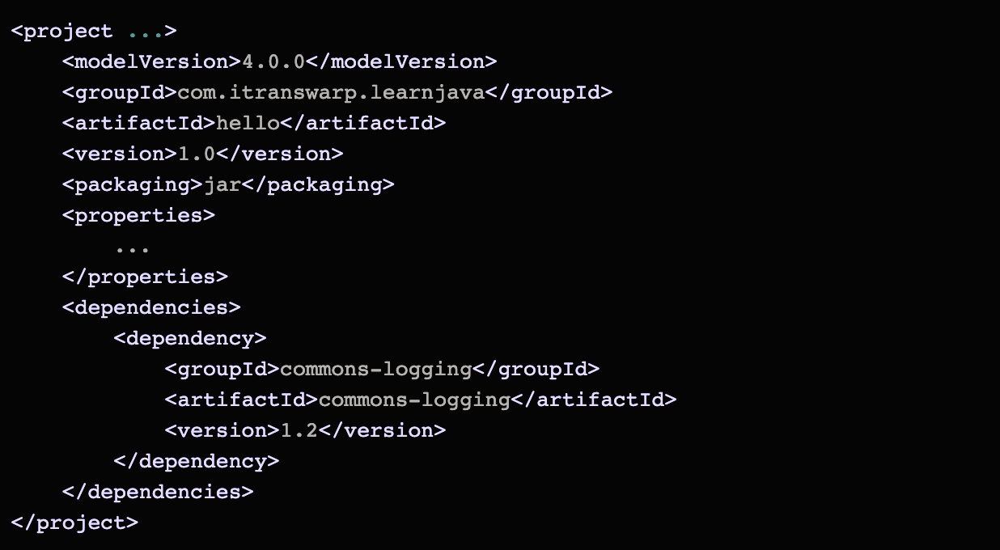

# Maven教程

## Maven介绍
我们先来看看一个Java项目需要的东西。首先，我们需要确定引入哪些依赖包。例如，如果我们需要用到commons logging，我们就必须把commons logging的jar包放入ClassPath。如果我们还需要log4j，就需要把log4j相关的jar包都放到ClassPath中。这些就是依赖包的管理。

其次我们需要确定项目结构. 例如, `src`目录存放源码`java源码`, `resource`目录存放配置文件, `bin`目录存放编译生成`.class`文件

此外, 
1. 配置环境 
2. 例如JDK版本
3. 编译打包的流程
4. 当前代码的版本号

我们还必须能通过命令行工具进行编译，才能够让项目在一个独立的服务器上编译、测试、部署。

Maven就是是专门为Java项目打造的管理和构建工具，它的主要功能有：

* 提供了一套标准化的项目结构；
* 提供了一套标准化的构建流程（编译，测试，打包，发布……）；
* 提供了一套依赖管理机制。

## Maven项目结构

一个使用Maven管理的普通的Java项目，它的目录结构默认如下：

1. 项目名: a-maven-project
2. 项目描述文件: pom.xml
3. 存放Java源码的目录: src/main/java
4. 存放资源文件的目录: src/main/resources
5. 存放测源码的目录: src/test/resources
6. 编译, 打包生成的文件: target目录

**groupId**: 类似于java包名, 通常是公司或组织名称
**artifactId**: java类名, 通常是项目名称, 再加上version

一个Maven工程就是由`groupId`，`artifactId`和`version`作为唯一标识, 我们在引用其他第三方库的时候，也是通过这3个变量确定。例如，依赖commons-logging：

## 依赖管理

Maven解决了**依赖管理**问题。例如，我们的项目依赖abc这个jar包，而abc又依赖xyz这个jar包：

当我们声明了abc的依赖时，Maven自动把abc和xyz都加入了我们的项目依赖，不需要我们自己去研究abc是否需要依赖xyz。

因此，Maven的第一个作用就是解决依赖管理。我们声明了自己的项目需要abc，Maven会自动导入abc的jar包，再判断出abc需要xyz，又会自动导入xyz的jar包，这样，最终我们的项目会依赖abc和xyz两个jar包。

**这是一个复杂依赖示例**

当我们声明一个`spring-boot-starter-web`依赖时，Maven会自动解析并判断最终需要大概二三十个其他依赖：
\

## 依赖关系

Maven定义了几种依赖关系，分别是`compile`、`test`、`runtime`和`provided`：

其中,默认的`compile`是最常用的, Maven会把这种类型的依赖直接放入ClassPath

`test`依赖表示仅在测试时使用，正常运行时并不需要。最常用的`test`依赖就是JUnit：

`runtime`依赖表示编译时不需要, 但运行时需要. 最典型的是`runtime`依赖是JDBC驱动, 例如MySQL驱动:

## 唯一ID

对于某个依赖，Maven只需要3个变量即可唯一确定某个jar包：

* groupId：属于组织的名称，类似Java的包名
* artifactId：该jar包自身的名称，类似Java的类名
* version：该jar包的版本

通过上述3个变量，即可唯一确定某个jar包。Maven通过对jar包进行PGP签名确保任何一个jar包一经发布就无法修改。修改已发布jar包的唯一方法是发布一个新版本。

因此，某个jar包一旦被Maven下载过，即可永久地安全缓存在本地。

注：只有以`-SNAPSHOT`结尾的版本号会被Maven视为开发版本，开发版本每次都会重复下载，这种SNAPSHOT版本只能用于内部私有的Maven repo，公开发布的版本不允许出现`SNAPSHOT`。

---
## 构建流程

Maven不但有标准化的项目结构，而且还有一套标准化的构建流程，可以**自动化实现编译，打包，发布**，等等。

### Lifecycle和Phase

使用Maven时，我们首先要了解什么是Maven的生命周期（lifecycle）。

Maven的生命周期由一系列阶段（phase）构成，以内置的生命周期`default`为例，它包含以下`phase`：

我们是使用 `mvn`, 后面参数是phase

在实际开发过程中，经常使用的命令有：

`mvn clean`：清理所有生成的class和jar；

`mvn clean compile`：先清理，再执行到compile；

`mvn clean test`：先清理，再执行到test，因为执行test前必须执行compile，所以这里不必指定compile；

`mvn clean package`：先清理，再执行到package。

## 使用插件

## 模块管理

在软件开发中, 把一个大项目拆分为多个模块是降低复杂度的有用方法:

对于一个maven大项目来说:

拆分完:

Maven可以有效管理过个模块, 我们只需要把每个模块当作一个独立的Maven项目, 它们拥有各自的pom.xml. 例如, 模块A的pom.xml:

模块B和A的pom文件中有重复的, 那么我们可以进行提取, 然后放在父pom里:

注意到parent的<packaging>是**pom**而不是**jar**，因为**parent本身不含任何Java代码**。编写parent的pom.xml只是为了在各个模块中减少重复的配置。现在我们的整个工程结构如下：

这样子模块A可以继承`parent`, 简化pom.xml的编写:

最后，在编译的时候，需要在根目录创建一个pom.xml统一编译：

