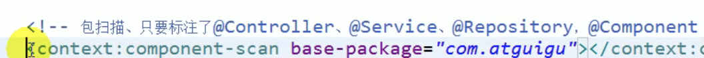
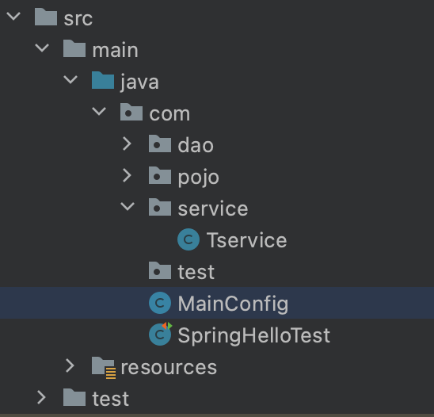

# 注解驱动开发

注解开发, 需要首先写一个配置类, 配置类 == 配置文件

## Configuration 
之前的配置都是写在XML文件里, 然后通过`ClassPathXmlApplicationContext` 去获取IOC, 改成注解后使用`AnnotationConfigApplicationContext`去获取.

```java
@Configuration
public class MainConfig {

    @Bean
    public Car car(){
        return new Car();
    }

}
```

```java
AnnotationConfigApplicationContext context = new AnnotationConfigApplicationContext(MainConfig.class);
String[] beanNamesForType = context.getBeanNamesForType(Car.class);
    for (String s : beanNamesForType) {
        System.out.println(s);
    }
Car bean = context.getBean(Car.class);
```
**修改注册的bean名字**
* 修改方法名
```java
 @Bean
    public Car car1(){
        return new Car();
    }
```
* 直接修改注解
```java
 @Bean("car1")
    public Car car(){
        return new Car();
    }
```

## @ComponentScan

XML配置的包扫描 

改成注解包扫描后:


**注意一下包路径**

```java
@Configuration
@ComponentScan("com")
public class MainConfig {

    @Bean
    public Car car1(){
        return new Car();
    }

}
```

```java
@Service
public class Tservice {
    public int b;
}
```

结果
```java
String[] beanNames = context.getBeanDefinitionNames();
org.springframework.context.annotation.internalConfigurationAnnotationProcessor
org.springframework.context.annotation.internalAutowiredAnnotationProcessor
org.springframework.context.annotation.internalRequiredAnnotationProcessor
org.springframework.context.annotation.internalCommonAnnotationProcessor
org.springframework.context.event.internalEventListenerProcessor
org.springframework.context.event.internalEventListenerFactory
mainConfig
testDaoImpl
tservice
car1
```
可以看到我们刚刚标注的service已经被扫描进去, 并且容器中有一些其他的类

> includeFilters()方法指定Spring扫描的时候按照什么规则只需要包含哪些组件，而excludeFilters()方法指定Spring扫描的时候按照什么规则排除哪些组件。两个方法的返回值都是Filter[]数组，在ComponentScan注解类的内部存在Filter注解类，大家可以看下上面的代码。

### 扫描时排除注解标注的类
现在有这样一个需求，除了**@Controller**和**@Service**标注的组件之外，IOC容器中剩下的组件我都要，即相当于是我要排除@Controller和@Service这俩注解标注的组件。要想达到这样一个目的，我们可以在MainConfig类上通过@ComponentScan注解的excludeFilters()方法实现。例如，我们在MainConfig类上添加了如下的注解
```java
@ComponentScan(value="com.meimeixia", excludeFilters={
		/*
		 * type：指定你要排除的规则，是按照注解进行排除，还是按照给定的类型进行排除，还是按照正则表达式进行排除，等等
		 * classes：除了@Controller和@Service标注的组件之外，IOC容器中剩下的组件我都要，即相当于是我要排除@Controller和@Service这俩注解标注的组件。
		 */
		@Filter(type=FilterType.ANNOTATION, classes={Controller.class, Service.class})
}) // value指定要扫描的包
```

### 扫描时只包含注解标注的类

我们也可以使用ComponentScan注解类中的includeFilters()方法来指定Spring在进行包扫描时，只包含哪些注解标注的类。

这里需要注意的是，当我们使用includeFilters()方法来指定只包含哪些注解标注的类时，需要**禁用掉默认的过滤规则**。

现在有这样一个需求，我们需要Spring在扫描时，只包含@Controller注解标注的类。要想达到这样一个目的，我们该怎么做呢？可以在MainConfig类上添加@ComponentScan注解，设置只包含@Controller注解标注的类，并禁用掉默认的过滤规则，如下所示。

```java
@ComponentScan(value="com.meimeixia", includeFilters={
		/*
		 * type：指定你要排除的规则，是按照注解进行排除，还是按照给定的类型进行排除，还是按照正则表达式进行排除，等等
		 * classes：我们需要Spring在扫描时，只包含@Controller注解标注的类
		 */
		@Filter(type=FilterType.ANNOTATION, classes={Controller.class})
}, useDefaultFilters=false) // value指定要扫描的包
```
### 重复注解

componentScan代码上有一个如下的注解
```java
@Retention(RetentionPolicy.RUNTIME)
@Target({ElementType.TYPE})
@Documented
@Repeatable(ComponentScans.class)
```

如果你用的是Java 8，那么@ComponentScan注解就是一个重复注解，也就是说我们可以在一个类上重复使用这个注解，如下所示。

```java
@ComponentScan(value="com.meimeixia", includeFilters={
		/*
		 * type：指定你要排除的规则，是按照注解进行排除，还是按照给定的类型进行排除，还是按照正则表达式进行排除，等等
		 * classes：我们需要Spring在扫描时，只包含@Controller注解标注的类
		 */
		@Filter(type=FilterType.ANNOTATION, classes={Controller.class})
}, useDefaultFilters=false) // value指定要扫描的包
@ComponentScan(value="com.meimeixia", includeFilters={
		/*
		 * type：指定你要排除的规则，是按照注解进行排除，还是按照给定的类型进行排除，还是按照正则表达式进行排除，等等
		 * classes：我们需要Spring在扫描时，只包含@Service注解标注的类
		 */
		@Filter(type=FilterType.ANNOTATION, classes={Service.class})
}, useDefaultFilters=false) // value指定要扫描的包
```
### 小结
我们可以使用@ComponentScan注解来指定Spring扫描哪些包，可以使用excludeFilters()方法来指定扫描时排除哪些组件，也可以使用includeFilters()方法来指定扫描时只包含哪些组件。当使用includeFilters()方法指定只包含哪些组件时，需要禁用掉默认的过滤规则。

## 自定义TypeFilter指定@ComponentScan注解的过滤规则

### 写在前面

虽然spring提供了很多过滤规则, 但是我们可以使用自己定义的规则对bean进行过滤

### TypeFilter中的常用规则
在使用@ComponentScan注解实现包扫描时，我们可以使用@Filter指定过滤规则，在@Filter中，通过type来指定过滤的类型。而@Filter注解中的type属性是一个FilterType枚举，其源码如下图所示。

```java
public enum FilterType {
    ANNOTATION,
    ASSIGNABLE_TYPE,
    ASPECTJ,
    REGEX,
    CUSTOM;
```

* **FilterType.ANNOTATION：按照注解进行包含或者排除**

例如，使用@ComponentScan注解进行包扫描时，如果要想按照注解只包含标注了@Controller注解的组件，那么就需要像下面这样写了。

```java
@ComponentScan(value="com.meimeixia", includeFilters={
		/*
		 * type：指定你要排除的规则，是按照注解进行排除，还是按照给定的类型进行排除，还是按照正则表达式进行排除，等等
		 * classes：我们需要Spring在扫描时，只包含@Controller注解标注的类
		 */
		@Filter(type=FilterType.ANNOTATION, classes={Controller.class})
}, useDefaultFilters=false) // value指定要扫描的包
```
* **FilterType.ASSIGNABLE_TYPE：按照给定的类型进行包含或者排除**
例如，使用@ComponentScan注解进行包扫描时，如果要想按照给定的类型只包含BookService类（接口）或其子类（实现类或子接口）的组件，那么就需要像下面这样写了。

```java
@ComponentScan(value="com.meimeixia", includeFilters={
		/*
		 * type：指定你要排除的规则，是按照注解进行排除，还是按照给定的类型进行排除，还是按照正则表达式进行排除，等等
		 */
		// 只要是BookService这种类型的组件都会被加载到容器中，不管是它的子类还是什么它的实现类。记住，只要是BookService这种类型的
		@Filter(type=FilterType.ASSIGNABLE_TYPE, classes={BookService.class})
}, useDefaultFilters=false) // value指定要扫描的包
```
此时，只要是BookService这种类型的组件，都会被加载到容器中。也就是说，当BookService是一个Java类时，`该类及其子类都会被加载到Spring容器中`；当BookService是一个接口时，`其子接口或实现类都会被加载到Spring容器中`。

* **FilterType.CUSTOM：按照自定义规则进行包含或者排除**

如果实现自定义规则进行过滤时，自定义规则的类必须是`org.springframework.core.type.filter.TypeFilter`接口的实现类。

要想按照自定义规则进行过滤，首先我们得创建org.springframework.core.type.filter.TypeFilter接口的一个实现类，例如MyTypeFilter，该实现类的代码一开始如下所示。

```java
public class MyTypeFilter implements TypeFilter {
    @Override
    public boolean match(MetadataReader metadataReader, MetadataReaderFactory metadataReaderFactory) throws IOException {
        return false;
    }
}
```
当我们实现TypeFilter接口时，需要实现该接口中的match()方法，match()方法的返回值为boolean类型。当返回true时，表示符合规则，会包含在Spring容器中；当返回false时，表示不符合规则，那就是一个都不匹配，自然就都不会被包含在Spring容器中。另外，在match()方法中存在两个参数，分别为MetadataReader类型的参数和MetadataReaderFactory类型的参数，含义分别如下。

* metadataReader：读取到的当前正在扫描的类的信息
* metadataReaderFactory：可以获取到其他任何类的信息的工厂

然后，使用@ComponentScan注解进行如下配置。

```java
@ComponentScan(value="com.meimeixia", includeFilters={
		/*
		 * type：指定你要排除的规则，是按照注解进行排除，还是按照给定的类型进行排除，还是按照正则表达式进行排除，等等
		 */
		// 指定新的过滤规则，这个过滤规则是我们自个自定义的，过滤规则就是由我们这个自定义的MyTypeFilter类返回true或者false来代表匹配还是没匹配
		@Filter(type=FilterType.CUSTOM, classes={MyTypeFilter.class})
}, useDefaultFilters=false) // value指定要扫描的包
```
FilterType枚举中的每一个枚举值的含义我都讲解完了，说了这么多，其实只有ANNOTATION和ASSIGNABLE_TYPE是比较常用的，**ASPECTJ和REGEX不太常用**，如果FilterType枚举中的类型无法满足我们的需求时，我们也可以通过实现org.springframework.core.type.filter.TypeFilter接口来自定义过滤规则，此时，将@Filter中的type属性设置为FilterType.CUSTOM，classes属性设置为自定义规则的类所对应的Class对象。

### 实现自定义过滤规则

```java
public class MyTypeFilter implements TypeFilter {
    @Override
    public boolean match(MetadataReader metadataReader, MetadataReaderFactory metadataReaderFactory) throws IOException {
        // 获取当前类注解的信息
        AnnotationMetadata annotationMetadata = metadataReader.getAnnotationMetadata();
        // 获取当前正在扫描的类的类信息，比如说它的类型是什么啊，它实现了什么接口啊之类的
        ClassMetadata classMetadata = metadataReader.getClassMetadata();
        // 获取当前类的资源信息，比如说类的路径等信息
        Resource resource = metadataReader.getResource();
        // 获取当前正在扫描的类的类名
        String className = classMetadata.getClassName();
        System.out.println("--->" + className);

        return true;
    }
}
```
