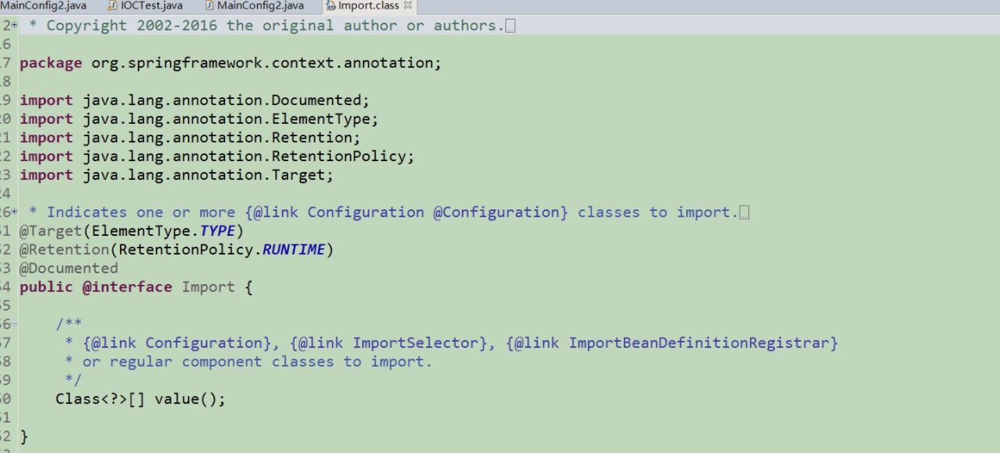
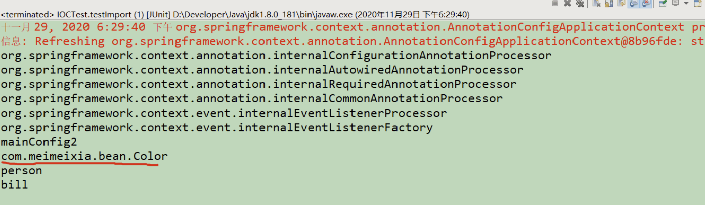
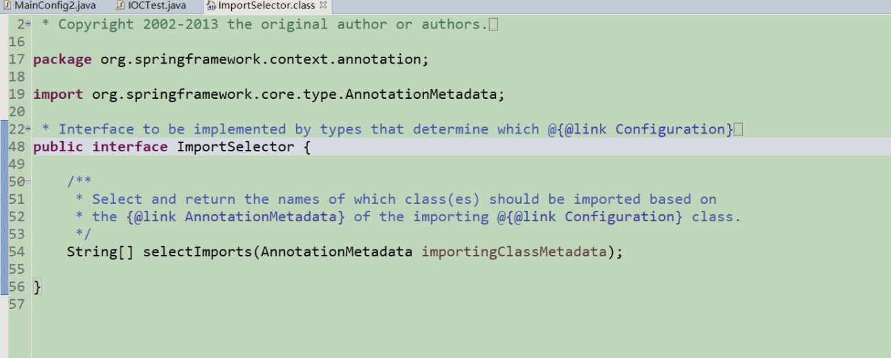
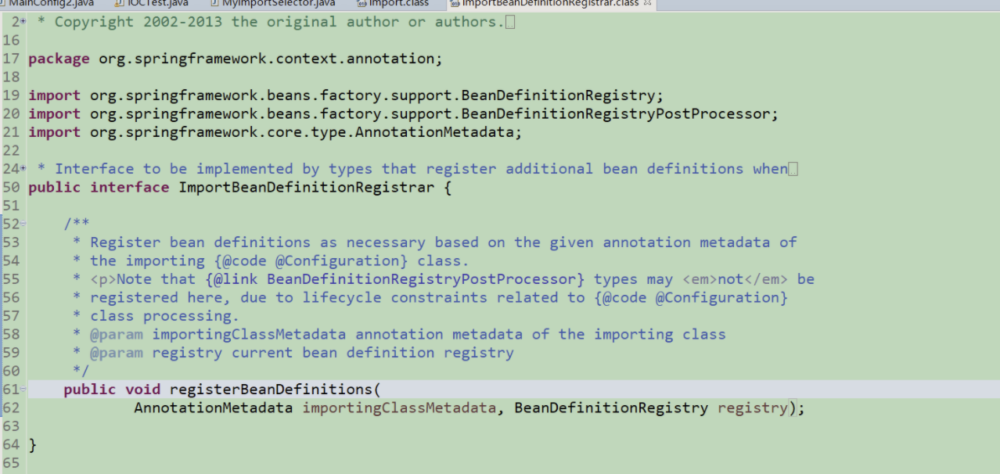

# 注解驱动开发

注解开发, 需要首先写一个配置类, 配置类 == 配置文件

## Configuration 
之前的配置都是写在XML文件里, 然后通过`ClassPathXmlApplicationContext` 去获取IOC, 改成注解后使用`AnnotationConfigApplicationContext`去获取.

```java
@Configuration
public class MainConfig {

    @Bean
    public Car car(){
        return new Car();
    }

}
```

```java
AnnotationConfigApplicationContext context = new AnnotationConfigApplicationContext(MainConfig.class);
String[] beanNamesForType = context.getBeanNamesForType(Car.class);
    for (String s : beanNamesForType) {
        System.out.println(s);
    }
Car bean = context.getBean(Car.class);
```
**修改注册的bean名字**
* 修改方法名
```java
 @Bean
    public Car car1(){
        return new Car();
    }
```
* 直接修改注解
```java
 @Bean("car1")
    public Car car(){
        return new Car();
    }
```

## @ComponentScan

XML配置的包扫描 

改成注解包扫描后:


**注意一下包路径**

```java
@Configuration
@ComponentScan("com")
public class MainConfig {

    @Bean
    public Car car1(){
        return new Car();
    }

}
```

```java
@Service
public class Tservice {
    public int b;
}
```

结果
```java
String[] beanNames = context.getBeanDefinitionNames();
org.springframework.context.annotation.internalConfigurationAnnotationProcessor
org.springframework.context.annotation.internalAutowiredAnnotationProcessor
org.springframework.context.annotation.internalRequiredAnnotationProcessor
org.springframework.context.annotation.internalCommonAnnotationProcessor
org.springframework.context.event.internalEventListenerProcessor
org.springframework.context.event.internalEventListenerFactory
mainConfig
testDaoImpl
tservice
car1
```
可以看到我们刚刚标注的service已经被扫描进去, 并且容器中有一些其他的类

> includeFilters()方法指定Spring扫描的时候按照什么规则只需要包含哪些组件，而excludeFilters()方法指定Spring扫描的时候按照什么规则排除哪些组件。两个方法的返回值都是Filter[]数组，在ComponentScan注解类的内部存在Filter注解类，大家可以看下上面的代码。

### 扫描时排除注解标注的类
现在有这样一个需求，除了**@Controller**和**@Service**标注的组件之外，IOC容器中剩下的组件我都要，即相当于是我要排除@Controller和@Service这俩注解标注的组件。要想达到这样一个目的，我们可以在MainConfig类上通过@ComponentScan注解的excludeFilters()方法实现。例如，我们在MainConfig类上添加了如下的注解
```java
@ComponentScan(value="com.meimeixia", excludeFilters={
		/*
		 * type：指定你要排除的规则，是按照注解进行排除，还是按照给定的类型进行排除，还是按照正则表达式进行排除，等等
		 * classes：除了@Controller和@Service标注的组件之外，IOC容器中剩下的组件我都要，即相当于是我要排除@Controller和@Service这俩注解标注的组件。
		 */
		@Filter(type=FilterType.ANNOTATION, classes={Controller.class, Service.class})
}) // value指定要扫描的包
```

### 扫描时只包含注解标注的类

我们也可以使用ComponentScan注解类中的includeFilters()方法来指定Spring在进行包扫描时，只包含哪些注解标注的类。

这里需要注意的是，当我们使用includeFilters()方法来指定只包含哪些注解标注的类时，需要**禁用掉默认的过滤规则**。

现在有这样一个需求，我们需要Spring在扫描时，只包含@Controller注解标注的类。要想达到这样一个目的，我们该怎么做呢？可以在MainConfig类上添加@ComponentScan注解，设置只包含@Controller注解标注的类，并禁用掉默认的过滤规则，如下所示。

```java
@ComponentScan(value="com.meimeixia", includeFilters={
		/*
		 * type：指定你要排除的规则，是按照注解进行排除，还是按照给定的类型进行排除，还是按照正则表达式进行排除，等等
		 * classes：我们需要Spring在扫描时，只包含@Controller注解标注的类
		 */
		@Filter(type=FilterType.ANNOTATION, classes={Controller.class})
}, useDefaultFilters=false) // value指定要扫描的包
```
### 重复注解

componentScan代码上有一个如下的注解
```java
@Retention(RetentionPolicy.RUNTIME)
@Target({ElementType.TYPE})
@Documented
@Repeatable(ComponentScans.class)
```

如果你用的是Java 8，那么@ComponentScan注解就是一个重复注解，也就是说我们可以在一个类上重复使用这个注解，如下所示。

```java
@ComponentScan(value="com.meimeixia", includeFilters={
		/*
		 * type：指定你要排除的规则，是按照注解进行排除，还是按照给定的类型进行排除，还是按照正则表达式进行排除，等等
		 * classes：我们需要Spring在扫描时，只包含@Controller注解标注的类
		 */
		@Filter(type=FilterType.ANNOTATION, classes={Controller.class})
}, useDefaultFilters=false) // value指定要扫描的包
@ComponentScan(value="com.meimeixia", includeFilters={
		/*
		 * type：指定你要排除的规则，是按照注解进行排除，还是按照给定的类型进行排除，还是按照正则表达式进行排除，等等
		 * classes：我们需要Spring在扫描时，只包含@Service注解标注的类
		 */
		@Filter(type=FilterType.ANNOTATION, classes={Service.class})
}, useDefaultFilters=false) // value指定要扫描的包
```
### 小结
我们可以使用@ComponentScan注解来指定Spring扫描哪些包，可以使用excludeFilters()方法来指定扫描时排除哪些组件，也可以使用includeFilters()方法来指定扫描时只包含哪些组件。当使用includeFilters()方法指定只包含哪些组件时，需要禁用掉默认的过滤规则。

## 自定义TypeFilter指定@ComponentScan注解的过滤规则

### 写在前面

虽然spring提供了很多过滤规则, 但是我们可以使用自己定义的规则对bean进行过滤

### TypeFilter中的常用规则
在使用@ComponentScan注解实现包扫描时，我们可以使用@Filter指定过滤规则，在@Filter中，通过type来指定过滤的类型。而@Filter注解中的type属性是一个FilterType枚举，其源码如下图所示。

```java
public enum FilterType {
    ANNOTATION,
    ASSIGNABLE_TYPE,
    ASPECTJ,
    REGEX,
    CUSTOM;
```

* **FilterType.ANNOTATION：按照注解进行包含或者排除**

例如，使用@ComponentScan注解进行包扫描时，如果要想按照注解只包含标注了@Controller注解的组件，那么就需要像下面这样写了。

```java
@ComponentScan(value="com.meimeixia", includeFilters={
		/*
		 * type：指定你要排除的规则，是按照注解进行排除，还是按照给定的类型进行排除，还是按照正则表达式进行排除，等等
		 * classes：我们需要Spring在扫描时，只包含@Controller注解标注的类
		 */
		@Filter(type=FilterType.ANNOTATION, classes={Controller.class})
}, useDefaultFilters=false) // value指定要扫描的包
```
* **FilterType.ASSIGNABLE_TYPE：按照给定的类型进行包含或者排除**
例如，使用@ComponentScan注解进行包扫描时，如果要想按照给定的类型只包含BookService类（接口）或其子类（实现类或子接口）的组件，那么就需要像下面这样写了。

```java
@ComponentScan(value="com.meimeixia", includeFilters={
		/*
		 * type：指定你要排除的规则，是按照注解进行排除，还是按照给定的类型进行排除，还是按照正则表达式进行排除，等等
		 */
		// 只要是BookService这种类型的组件都会被加载到容器中，不管是它的子类还是什么它的实现类。记住，只要是BookService这种类型的
		@Filter(type=FilterType.ASSIGNABLE_TYPE, classes={BookService.class})
}, useDefaultFilters=false) // value指定要扫描的包
```
此时，只要是BookService这种类型的组件，都会被加载到容器中。也就是说，当BookService是一个Java类时，`该类及其子类都会被加载到Spring容器中`；当BookService是一个接口时，`其子接口或实现类都会被加载到Spring容器中`。

* **FilterType.CUSTOM：按照自定义规则进行包含或者排除**

如果实现自定义规则进行过滤时，自定义规则的类必须是`org.springframework.core.type.filter.TypeFilter`接口的实现类。

要想按照自定义规则进行过滤，首先我们得创建org.springframework.core.type.filter.TypeFilter接口的一个实现类，例如MyTypeFilter，该实现类的代码一开始如下所示。

```java
public class MyTypeFilter implements TypeFilter {
    @Override
    public boolean match(MetadataReader metadataReader, MetadataReaderFactory metadataReaderFactory) throws IOException {
        return false;
    }
}
```
当我们实现TypeFilter接口时，需要实现该接口中的match()方法，match()方法的返回值为boolean类型。当返回true时，表示符合规则，会包含在Spring容器中；当返回false时，表示不符合规则，那就是一个都不匹配，自然就都不会被包含在Spring容器中。另外，在match()方法中存在两个参数，分别为MetadataReader类型的参数和MetadataReaderFactory类型的参数，含义分别如下。

* metadataReader：读取到的当前正在扫描的类的信息
* metadataReaderFactory：可以获取到其他任何类的信息的工厂

然后，使用@ComponentScan注解进行如下配置。

```java
@ComponentScan(value="com.meimeixia", includeFilters={
		/*
		 * type：指定你要排除的规则，是按照注解进行排除，还是按照给定的类型进行排除，还是按照正则表达式进行排除，等等
		 */
		// 指定新的过滤规则，这个过滤规则是我们自个自定义的，过滤规则就是由我们这个自定义的MyTypeFilter类返回true或者false来代表匹配还是没匹配
		@Filter(type=FilterType.CUSTOM, classes={MyTypeFilter.class})
}, useDefaultFilters=false) // value指定要扫描的包
```
FilterType枚举中的每一个枚举值的含义我都讲解完了，说了这么多，其实只有ANNOTATION和ASSIGNABLE_TYPE是比较常用的，**ASPECTJ和REGEX不太常用**，如果FilterType枚举中的类型无法满足我们的需求时，我们也可以通过实现org.springframework.core.type.filter.TypeFilter接口来自定义过滤规则，此时，将@Filter中的type属性设置为FilterType.CUSTOM，classes属性设置为自定义规则的类所对应的Class对象。

### 实现自定义过滤规则

```java
public class MyTypeFilter implements TypeFilter {
    @Override
    public boolean match(MetadataReader metadataReader, MetadataReaderFactory metadataReaderFactory) throws IOException {
        // 获取当前类注解的信息
        AnnotationMetadata annotationMetadata = metadataReader.getAnnotationMetadata();
        // 获取当前正在扫描的类的类信息，比如说它的类型是什么啊，它实现了什么接口啊之类的
        ClassMetadata classMetadata = metadataReader.getClassMetadata();
        // 获取当前类的资源信息，比如说类的路径等信息
        Resource resource = metadataReader.getResource();
        // 获取当前正在扫描的类的类名
        String className = classMetadata.getClassName();
        System.out.println("--->" + className);

        return true;
    }
}
```

## 使用@Scope注解设置组件的作用域

### 写在前面

spring中的组件默认是单例的, 在spring启动的时候就会初始化对象,并将其放到IOC容器, 之后, 每次获取对象时, 直接从spring容器中获取, 而不再创建对象. 之后每次都是直接从容器中取对象. 如果要不用单例的方式, 我们可以使用@scope注解来设置bean的作用域

###  文本内容的概述

* @Scope注解概述
* 单实例bean作用域
* 多实例bean作用域
* 单实例bean作用域如何创建对象？
* 多实例bean作用域如何创建对象？
* 单实例bean注意的事项
* 多实例bean注意的事项
* 自定义Scope的实现

scope注解可以有
从@Scope注解类的源码中可以看出，在@Scope注解中可以设置如下值：

1. ConfigurableBeanFactory#SCOPE_PROTOTYPE
2. ConfigurableBeanFactory#SCOPE_SINGLETON
3. org.springframework.web.context.WebApplicationContext#SCOPE_REQUEST
4. org.springframework.web.context.WebApplicationContext#SCOPE_SESSION


单实例bean在容器启动的时候, 就会创建, 然后放入容器中
多实例bean在获取bean的时候, 才会创建, 然后放入容器中

## 如何实现懒加载

### 写在前面

spring在启动时, 默认将单实例bean进行实例化, 并且加载到spring容器中去. 也就是说单实例bean在spring容器启动的时候创建对象, 并且还会将对象加载到Spring容器中. 如果我们需要对某个bean进行延迟加载, 可以使用@Lazy注解


### 懒加载

何为懒加载呢？懒加载就是Spring容器启动的时候，先不创建对象，在第一次使用（获取）bean的时候再来创建对象，并进行一些初始化。

## 按照条件向Spring容器中注册bean

### 复习

当bean是`单实例`，并且`没有设置懒加载`时，Spring容器启动时，就会实例化bean，并将bean注册到IOC容器中，以后每次从IOC容器中获取bean时，直接返回IOC容器中的bean，而不用再创建新的bean了。

若bean是`单实例`，并且使用`@Lazy注解设置了懒加载`，则Spring容器启动时，不会立即实例化bean，自然就不会将bean注册到IOC容器中了，只有第一次获取bean的时候，才会实例化bean，并且将bean注册到IOC容器中。

若bean是`多实例`，则Spring容器启动时，不会实例化bean，也不会将bean注册到IOC容器中，只是在以后每次从IOC容器中获取bean的时候，都会创建一个新的bean返回。

其实，Spring支持按**照条件向IOC容器中注册bean**，满足条件的bean就会被注册到IOC容器中，不满足条件的bean就不会被注册到IOC容器中。接下来，我们就一起来探讨一下Spring中是如何实现按照条件向IOC容器中注册bean的。


### @Conditional注解概述

@Conditional注解可以按照一定的条件进行判断，满足条件向容器中注册bean，不满足条件就不向容器中注册bean。

@Conditional注解是由Spring Framework提供的一个注解，它位于 org.springframework.context.annotation包内，定义如下。

```java
@Target({ElementType.TYPE, ElementType.METHOD})
@Retention(RetentionPolicy.RUNTIME)
@Documented
public @interface Conditional {
    Class<? extends Condition>[] value();
}
```

从@Conditional注解的源码来看，@Conditional注解不仅可以添加到**类**上，也可以添加到**方法**上。在@Conditional注解中，还存在着一个Condition类型或者其子类型的Class对象数组，Condition是个啥呢？我们点进去看一下。

```java
@FunctionalInterface
public interface Condition {
    boolean matches(ConditionContext var1, AnnotatedTypeMetadata var2);
}
```
可以看到，它是一个接口。所以，我们使用@Conditional注解时，需要写一个类来实现Spring提供的Condition接口，这时候就会调用我们实现的方法进行定制化的检查类是否导入.

我们可以在哪些场合使用@Conditional注解呢？@Conditional注解的使用场景如下图所示。 

### 带条件的bean注册

现在，我们就要提出一个新的需求了，比如，如果当前操作系统是Windows操作系统，那么就向Spring容器中注册名称为bill的Person对象；如果当前操作系统是Linux操作系统，那么就向Spring容器中注册名称为linus的Person对象。要想实现这个需求，我们就得要使用@Conditional注解了。

这里，有小伙伴可能会问，如何获取操作系统的类型呢？别急，这个问题很简单，我们继续向下看。

使用Spring中的AnnotationConfigApplicationContext类就能够获取到当前操作系统的类型，如下所示。

```java
ConfigurableEnvironment environment = context.getEnvironment();
System.out.println(environment.getProperty("os.name"));
```

```java
package com.meimeixia.condition;

import org.springframework.beans.factory.config.ConfigurableListableBeanFactory;
import org.springframework.beans.factory.support.BeanDefinitionRegistry;
import org.springframework.context.annotation.Condition;
import org.springframework.context.annotation.ConditionContext;
import org.springframework.core.env.Environment;
import org.springframework.core.type.AnnotatedTypeMetadata;

/**
* 判断操作系统是否是Linux系统
* @author liayun
*
*/
public class LinuxCondition implements Condition {

    /**
    * ConditionContext：判断条件能使用的上下文（环境）
    * AnnotatedTypeMetadata：当前标注了@Conditional注解的注释信息
    */
    @Override
    public boolean matches(ConditionContext context, AnnotatedTypeMetadata metadata) {
        // 判断操作系统是否是Linux系统
        
        // 1. 获取到bean的创建工厂（能获取到IOC容器使用到的BeanFactory，它就是创建对象以及进行装配的工厂）
        ConfigurableListableBeanFactory beanFactory = context.getBeanFactory();
        // 2. 获取到类加载器
        ClassLoader classLoader = context.getClassLoader();
        // 3. 获取当前环境信息，它里面就封装了我们这个当前运行时的一些信息，包括环境变量，以及包括虚拟机的一些变量
        Environment environment = context.getEnvironment();
        // 4. 获取到bean定义的注册类
        BeanDefinitionRegistry registry = context.getRegistry();
        
        String property = environment.getProperty("os.name");
        if (property.contains("linux")) {
            return true;
        }
        
        return false;
    }

}
```

context的getRegistry()方法获取到的bean定义的注册对象，即BeanDefinitionRegistry对象了。它到底是个啥呢？我们可以点进去看一下它的源码，如下所示，可以看到它是一个接口。 

在上图中我对BeanDefinitionRegistry接口的源码作了一点简要的说明。知道了，Spring容器中所有的bean都可以通过BeanDefinitionRegistry对象来进行注册，因此我们可以通过它来查看Spring容器中到底注册了哪些bean。而且仔细查看一下BeanDefinitionRegistry接口中声明的各个方法，你就知道我们还可以通过BeanDefinitionRegistry对象向Spring容器中注册一个bean、移除一个bean、查询某一个bean的定义信息或者判断Spring容器中是否包含有某一个bean的定义。

因此，我们可以在这儿做更多的判断，比如说我可以判断一下Spring容器中是不是包含有某一个bean，就像下面这样，如果Spring容器中果真包含有名称为person的bean，那么就做些什么事情，如果没包含，那么我们还可以利用BeanDefinitionRegistry对象向Spring容器中注册一个bean。

```java
 // 1. 获取到bean的创建工厂（能获取到IOC容器使用到的BeanFactory，它就是创建对象以及进行装配的工厂）
        ConfigurableListableBeanFactory beanFactory = context.getBeanFactory();
        // 2. 获取到类加载器
        ClassLoader classLoader = context.getClassLoader();
        // 3. 获取当前环境信息，它里面就封装了我们这个当前运行时的一些信息，包括环境变量，以及包括虚拟机的一些变量
        Environment environment = context.getEnvironment();
        // 4. 获取到bean定义的注册类
        BeanDefinitionRegistry registry = context.getRegistry();
        
        // 在这儿还可以做更多的判断，比如说我判断一下Spring容器中是不是包含有某一个bean，就像下面这样，如果Spring容器中果真包含有名称为person的bean，那么就做些什么事情...
        boolean definition = registry.containsBeanDefinition("person");

        String property = environment.getProperty("os.name");
        if (property.contains("linux")) {
            return true;
        }
        
        return false;
```

此外，@Conditional注解也可以标注在类上，标注在类上的含义是：只有满足了当前条件，这个配置类中配置的所有bean注册才能生效，也就是对配置类中的组件进行统一设置。

```java
// 对配置类中的组件进行统一设置
@Conditional({WindowsCondition.class}) // 满足当前条件，这个类中配置的所有bean注册才能生效
@Configuration
public class MainConfig2 {
	
	@Lazy
	@Bean("person")
	public Person person() {
		System.out.println("给容器中添加咱们这个Person对象...");
		return new Person("美美侠", 25);
	}
	
	@Bean("bill")
	public Person person01() {
		return new Person("Bill Gates", 62);
	}
	
	@Conditional({LinuxCondition.class})
	@Bean("linus")
	public Person person02() {
		return new Person("linus", 48);
	}
	
}
```

### Conditional的扩展注解


## 使用@import注解给容器中快速导入一个组件

### 写在前面

我们知道，我们可以将一些bean组件交由Spring来管理，并且Spring还支持单实例bean和多实例bean。我们自己写的类，自然是可以通过包扫描+给组件标注注解（@Controller、@Servcie、@Repository、@Component）的形式将其注册到IOC容器中，但这种方式比较有局限性，局限于我们自己写的类，比方说我们自己写的类，我们当然能把以上这些注解标注上去了。

那么如果不是我们自己写的类，比如说我们在项目中会经常引入一些第三方的类库，我们需要将这些第三方类库中的类注册到Spring容器中，该怎么办呢？此时，我们就可以使用@Bean和@Import注解将这些类快速的导入Spring容器中。

### 注册bean的方式

向Spring容器中注册bean通常有以下几种方式：

1. 包扫描+给组件标注注解（@Controller、@Servcie、@Repository、@Component），但这种方式比较有局限性，局限于我们自己写的类
2. @Bean注解，通常用于导入第三方包中的组件
3. `@Import`注解，快速向Spring容器中导入一个组件

### @Import注解概述

Spring 3.0之前，创建bean可以通过XML配置文件与扫描特定包下面的类来将类注入到Spring IOC容器内。而在Spring 3.0之后提供了JavaConfig的方式，也就是将IOC容器里面bean的元信息以Java代码的方式进行描述，然后我们可以通过@Configuration与@Bean这两个注解配合使用来将原来配置在XML文件里面的bean通过Java代码的方式进行描述。

@Import注解提供了@Bean注解的功能，同时还有XML配置文件里面标签组织多个分散的XML文件的功能，当然在这里是组织多个分散的@Configuration，因为一个配置类就约等于一个XML配置文件。

我们先看一下@Import注解的源码，如下所示。 

从源码里面可以看出@Import可以配合`Configuration`、`ImportSelector`以及`ImportBeanDefinitionRegistrar`来使用，下面的or表示也可以把Import当成普通的bean来使用。

**注意：@Import注解只允许放到类上面，不允许放到方法上。**

`**@Import注解的使用方式**`

@Import注解的三种用法主要包括：

1. 直接填写class数组的方式
2. ImportSelector接口的方式，即批量导入，这是重点
3. ImportBeanDefinitionRegistrar接口方式，即手工注册bean到容器中
注意：我们先来看第一种方法，即直接填写class数组的方式，其他的两种方式我后面会继续讲解。

```java
// 对配置类中的组件进行统一设置
@Conditional({WindowsCondition.class}) // 满足当前条件，这个类中配置的所有bean注册才能生效
@Configuration
@Import(Color.class) // @Import快速地导入组件，id默认是组件的全类名
public class MainConfig2 {
	
	@Lazy
	@Bean("person")
	public Person person() {
		System.out.println("给容器中添加咱们这个Person对象...");
		return new Person("美美侠", 25);
	}
	
	@Bean("bill")
	public Person person01() {
		return new Person("Bill Gates", 62);
	}
	
	@Conditional({LinuxCondition.class})
	@Bean("linus")
	public Person person02() {
		return new Person("linus", 48);
	}
	
}
```

然后，我们运行IOCTest类中的testImport()方法，会发现输出的结果信息如下所示。 

可以看到，输出结果中打印了com.meimeixia.bean.Color，说明使用@Import注解快速地导入组件时，容器中就会自动注册这个组件，并且**id默认是组件的全类名**。

```java
@Import({Color.class, Red.class}) // @Import快速地导入组件，id默认是组件的全类名
```

支持同时导入多个类

## @Import注解中使用ImportSelector接口导入bean

### 复习

@Import注解总共包含三种使用方法，上一讲已经讲解完第一种方式了，今天我们就一起来学习下关于@Import注解非常重要的第二种方式，即ImportSelector接口的方式。SpringBoot中很多使用了这个方法进行导入!

### ImportSelector 接口概述

ImportSelector接口是Spring中导入外部配置的核心接口，在Spring Boot的自动化配置和`@EnableXXX`都有它的存在。我们先来看一下ImportSelector接口的源码，如下所示。 

该接口文档上说的明明白白，其主要作用是收集需要导入的配置类，`selectImports()`方法的返回值就是我们向Spring容器中导入的类的全类名。如果该接口的实现类同时实现EnvironmentAware，BeanFactoryAware，BeanClassLoaderAware或者ResourceLoaderAware，那么在调用其selectImports()方法之前先调用上述接口中对应的方法，如果需要在所有的@Configuration处理完再导入时，那么可以实现DeferredImportSelector接口。

在ImportSelector接口的selectImports()方法中，存在一个AnnotationMetadata类型的参数，这个参数能够获取到当前标注`@Import`注解的类的所有注解信息，也就是说不仅能获取到`@Import`注解里面的信息，还能获取到其他注解的信息。

### ImportSelector 接口实例

首先，我们创建一个MyImportSelector类实现ImportSelector接口，如下所示，先在selectImports()方法中返回null，后面我们再来改。

```java
package com.meimeixia.condition;

import org.springframework.context.annotation.ImportSelector;
import org.springframework.core.type.AnnotationMetadata;

/**
 * 自定义逻辑，返回需要导入的组件
 * @author liayun
 *
 */
public class MyImportSelector implements ImportSelector {

	// 返回值：就是要导入到容器中的组件的全类名
	// AnnotationMetadata：当前标注@Import注解的类的所有注解信息，也就是说不仅能获取到@Import注解里面的信息，还能获取到其他注解的信息
	@Override
	public String[] selectImports(AnnotationMetadata importingClassMetadata) { // 在这一行打个断点，debug调试一下
		return null;
	}

}
```
然后MainConfig配置类@import注解中, 导入我们实现的接口 

```java
// 对配置类中的组件进行统一设置
@Conditional({WindowsCondition.class}) // 满足当前条件，这个类中配置的所有bean注册才能生效
@Configuration
@Import({Color.class, Red.class, MyImportSelector.class}) // @Import快速地导入组件，id默认是组件的全类名
public class MainConfig2 {

	@Lazy
	@Bean("person")
	public Person person() {
		System.out.println("给容器中添加咱们这个Person对象...");
		return new Person("美美侠", 25);
	}

	@Bean("bill")
	public Person person01() {
		return new Person("Bill Gates", 62);
	}
	
	@Conditional({LinuxCondition.class})
	@Bean("linus")
	public Person person02() {
		return new Person("linus", 48);
	}
	
}
```

至于使用MyImportSelector类要导入哪些bean，就需要你在MyImportSelector类的selectImports()方法中进行设置了，只须在MyImportSelector类的selectImports()方法中返回要导入的类的全类名（包名+类名）即可。

```java
public class MyImportSelector implements ImportSelector {

	// 返回值：就是要导入到容器中的组件的全类名
	// AnnotationMetadata：当前标注@Import注解的类的所有注解信息，也就是说不仅能获取到@Import注解里面的信息，还能获取到其他注解的信息
	@Override
	public String[] selectImports(AnnotationMetadata importingClassMetadata) { // 在这一行打个断点，debug调试一下
		
		// 方法不要返回null值，否则会报空指针异常
//		return new String[]{}; // 可以返回一个空数组
		return new String[]{"com.meimeixia.bean.Bule", "com.meimeixia.bean.Yellow"};
	}

}
```

接着，我们运行IOCTest类的testImport()方法，输出的结果信息如下所示。 

可以看到，输出结果中多出了com.meimeixia.bean.Bule和com.meimeixia.bean.Yellow。这说明使用ImportSelector接口的方式已经成功将Bule类和Yellow类导入到Spring容器中去了。

## 在@Import注解中使用ImportBeanDefinitionRegistrar 中注册bean

### 回顾

@Import注解快速向容器中导入bean，也可以在@Import注解中使用ImportSelector接口的方法导入bean，今天，我们就来说说，如何在@Import注解中使用ImportBeanDefinitionRegistrar向容器中注册bean。

### ImportBeanDefinitionRegistrar接口的简要介绍

我们先来看看ImportBeanDefinitionRegistrar是个什么鬼，点击进入ImportBeanDefinitionRegistrar源码，如下所示。 

由源码可以看出，ImportBeanDefinitionRegistrar本质上是一个接口。在ImportBeanDefinitionRegistrar接口中，有一个registerBeanDefinitions()方法，通过该方法，我们可以向Spring容器中注册bean实例。

Spring官方在动态注册bean时，大部分套路其实是使用ImportBeanDefinitionRegistrar接口。

所有实现了该接口的类都会被ConfigurationClassPostProcessor处理，ConfigurationClassPostProcessor实现了BeanFactoryPostProcessor接口，所以ImportBeanDefinitionRegistrar中动态注册的bean是优先于依赖其的bean初始化的，也能被aop、validator等机制处理。

## 使用方法

ImportBeanDefinitionRegistrar需要配合@Configuration和@Import这俩注解，其中，@Configuration注解定义Java格式的Spring配置文件，@Import注解导入实现了ImportBeanDefinitionRegistrar接口的类。

## ImportBeanDefinitionRegistrar接口实例

既然ImportBeanDefinitionRegistrar是一个接口，那我们就创建一个MyImportBeanDefinitionRegistrar类，去实现ImportBeanDefinitionRegistrar接口，如下所示。

```java
package com.meimeixia.condition;

import org.springframework.beans.factory.support.BeanDefinitionRegistry;
import org.springframework.context.annotation.ImportBeanDefinitionRegistrar;
import org.springframework.core.type.AnnotationMetadata;

public class MyImportBeanDefinitionRegistrar implements ImportBeanDefinitionRegistrar {

	/**
	 * AnnotationMetadata：当前类的注解信息
	 * BeanDefinitionRegistry：BeanDefinition注册类
	 * 
	 * 我们可以通过调用BeanDefinitionRegistry接口中的registerBeanDefinition方法，手动注册所有需要添加到容器中的bean
	 */
	@Override
	public void registerBeanDefinitions(AnnotationMetadata importingClassMetadata, BeanDefinitionRegistry registry) {

	}

}
```
可以看到，这里，我们先创建了MyImportBeanDefinitionRegistrar类的大体框架。然后，我们在MainConfig2配置类上的@Import注解中，添加MyImportBeanDefinitionRegistrar类，如下所示。


```java
// 对配置类中的组件进行统一设置
@Conditional({WindowsCondition.class}) // 满足当前条件，这个类中配置的所有bean注册才能生效
@Configuration
@Import({Color.class, Red.class, MyImportSelector.class, MyImportBeanDefinitionRegistrar.class}) // @Import快速地导入组件，id默认是组件的全类名
public class MainConfig2 {
	
	@Lazy
	@Bean("person")
	public Person person() {
		System.out.println("给容器中添加咱们这个Person对象...");
		return new Person("美美侠", 25);
	}
	
	@Bean("bill")
	public Person person01() {
		return new Person("Bill Gates", 62);
	}
	
	@Conditional({LinuxCondition.class})
	@Bean("linus")
	public Person person02() {
		return new Person("linus", 48);
	}
	
}
```

我们接下来去实现方法

```java
public class MyImportBeanDefinitionRegistrar implements ImportBeanDefinitionRegistrar {

	/**
	 * AnnotationMetadata：当前类的注解信息
	 * BeanDefinitionRegistry：BeanDefinition注册类
	 * 
	 * 我们可以通过调用BeanDefinitionRegistry接口中的registerBeanDefinition方法，手动注册所有需要添加到容器中的bean
	 */
	@Override
	public void registerBeanDefinitions(AnnotationMetadata importingClassMetadata, BeanDefinitionRegistry registry) {
		boolean definition = registry.containsBeanDefinition("com.meimeixia.bean.Red");
		boolean definition2 = registry.containsBeanDefinition("com.meimeixia.bean.Bule");
		if (definition && definition2) {
			// 指定bean的定义信息，包括bean的类型、作用域等等
			// RootBeanDefinition是BeanDefinition接口的一个实现类
			RootBeanDefinition beanDefinition = new RootBeanDefinition(RainBow.class); // bean的定义信息
			// 注册一个bean，并且指定bean的名称
			registry.registerBeanDefinition("rainBow", beanDefinition);
		}
	}

}
```
