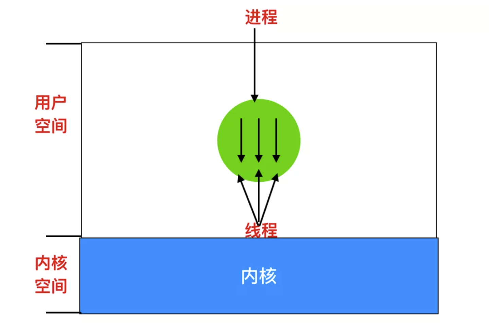
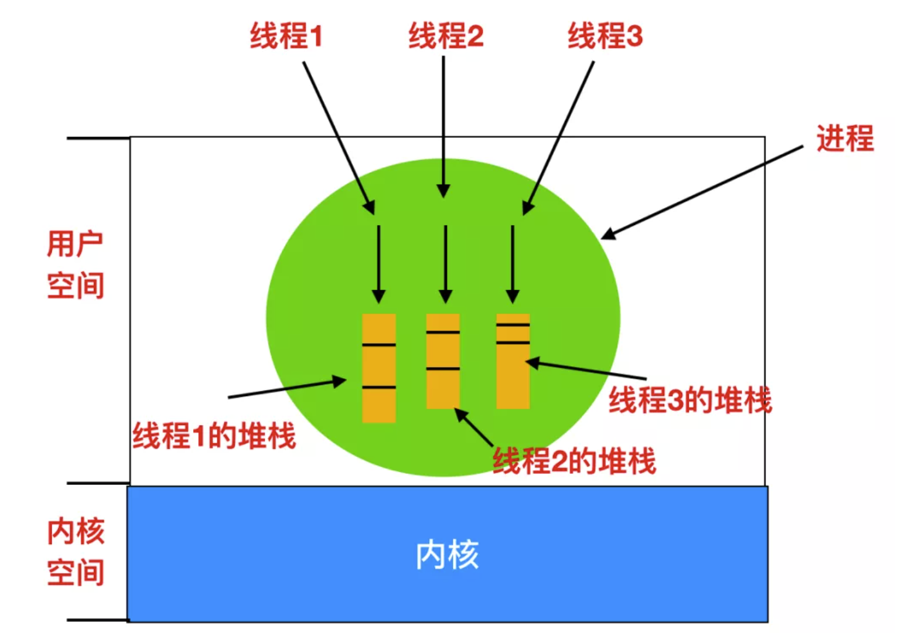

# 并发础知识

## 并发历史

操作系统的出现为我们的程序带来了`并发性`,操作系统能够让我们的计算机同时运行多个程序,一个**程序**就是一个**进程**,就相当于运行多个**进程**

> 程序和进程的区别: 程序并不能单独执行，只有将`程序加载到内存`中，系统为他分配资源后才能够执行，这种执行的**程序**称之为**进程**，也就是说进程是系统进行资源分配和调度的一个独立单位，每个进程都有自己单独的地址空间。所以说程序与进程的区别在于，程序是指令的集合，是进程运行的静态描述文本，而进程则是程序在系统上顺序执行时的动态活动。

操作系统是一个`并发系统`,**并发**是操作系统重要特征,操作系统具有同时处理和调度多个程序的能力，比如多个 I/O 设备同时在输入输出；**设备 I/O 和 CPU 计算同时进行**；内存中同时有多个系统和用户程序被启动交替、穿插地执行。操作系统在协调和分配进程的同时，操作系统也会为不同进程分配不同的资源。

操作系统实现多个程序同时运行解决了单个程序无法做到的问题,主要有三点:
1. 资源利用率
2. 公平性: 时间片, 优先级, 进程饥饿
3. 便利性: 信息交换, 信息孤岛

---
单线程编程的好处: 直观,简单

### 进程和线程

如果你还不是很理解进程和线程的区别的话，那么我就以我多年操作系统的经验（吹牛逼，实则半年）来为你解释一下：`进程是一个应用程序，而线程是应用程序中的一条顺序流`。

进程中会有多个线程来完成一些任务，这些任务有可能相同有可能不同。每个线程都有自己的执行顺序。

* 线程共有: 
* 线程私有空间: 

